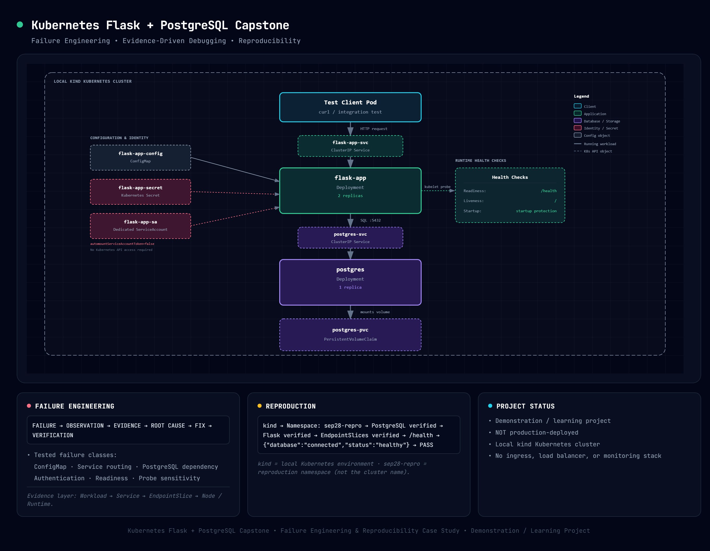

# flask-devops-app - Kubernetes Deployment

## Project Overview


A Kubernetes-deployed Flask application integrated with PostgreSQL, using Kubernetes Deployments, Services, ConfigMap/Secret configuration, health probes, a PersistentVolumeClaim, and a dedicated ServiceAccount. The project is a hands-on Kubernetes/DevOps learning system focused on deployment, dependency-aware health, failure engineering, diagnosis, recovery, and reproducibility.

## Quick Navigation

- [Architecture](#architecture)
- [Failure Engineering](#failure-engineering)
- [Debugging Method](#debugging-method)
- [Reproduction](#reproduction)
- [Security Notes](#security-notes)
- [Known Limitations](#known-limitations)
- [Future Work](#future-work)

## Project Purpose

This project exists as a hands-on Kubernetes engineering and debugging exercise. The work focuses on understanding Kubernetes reconciliation, service discovery, storage, probes, configuration, least-privilege identity, controlled failure injection, evidence-based diagnosis, recovery, and reproducibility.

## Architecture

```text
                         ┌──────────────────────┐
                         │   Test Client Pod    │
                         └──────────┬───────────┘
                                    │
                                    ▼
                         ┌──────────────────────┐
                         │    flask-app-svc     │
                         │       ClusterIP      │
                         └──────────┬───────────┘
                                    │
                                    ▼
                         ┌──────────────────────┐
                         │     flask-app        │
                         │     Deployment       │
                         │      2 replicas      │
                         └──────────┬───────────┘
                                    │
                       DB connection│
                                    ▼
                         ┌──────────────────────┐
                         │    postgres-svc      │
                         │       ClusterIP      │
                         └──────────┬───────────┘
                                    │
                                    ▼
                         ┌──────────────────────┐
                         │      postgres        │
                         │     Deployment       │
                         │      1 replica       │
                         └──────────┬───────────┘
                                    │
                                    ▼
                         ┌──────────────────────┐
                         │    postgres-pvc      │
                         │   persistent data    │
                         └──────────────────────┘

 Flask configuration:
    flask-app-config  ──────► Flask Pod
    flask-app-secret  ──────► Flask Pod

 Flask identity:
    flask-app-sa ───────────► Flask Pod
```

## Resource Map

| Resource Type | Purpose |
| --- | --- |
| `flask-app` | Deployment: Runs Flask application |
| `flask-app-svc` | Service: Internal access to Flask Pods |
| `flask-app-config` | ConfigMap: Non-sensitive application configuration |
| `flask-app-secret` | Secret: Sensitive Flask DB configuration |
| `postgres` | Deployment: Runs PostgreSQL |
| `postgres-svc` | Service: Internal PostgreSQL service discovery |
| `postgres-pvc` | PersistentVolumeClaim: PostgreSQL persistent storage |
| `flask-app-sa` | ServiceAccount: Workload identity |

## Request Flow

`client` → `flask-app-svc` → `flask-app Pod` → `postgres-svc` → `postgres Pod`

## Configuration

Application environment variables (`APP_MODE`, `DB_HOST`, `DB_NAME`, `DB_PORT`) are injected via ConfigMap.

## Secret Handling

Database credentials are created locally and supplied to Kubernetes as a Secret. Runtime Secret values are not committed to the repository. The repository therefore contains configuration/templates and operational instructions, not the actual runtime credential value.

**Important:** Base64 encoding is not encryption. Base64 is a reversible representation format; confidentiality depends on access control and, where configured, encryption at rest or an external secrets-management system.

## Probes

Readiness uses `/health` because the endpoint represents the application's dependency-aware health state.

Liveness uses `/`. This route is documented here only after its route/code semantics and live runtime behavior were verified as appropriate for process health and independent of the PostgreSQL dependency.

The startup probe provides startup protection before normal readiness and liveness behavior takes over, following the probe reasoning established earlier in September.

## Resources

| Workload | Resource | Request | Limit |
| --- | --- | --- | --- |
| Flask | CPU | 50m | 150m |
| Flask | Memory | 64Mi | 128Mi |
| PostgreSQL | CPU | 100m | 300m |
| PostgreSQL | Memory | 256Mi | 512Mi |

These are reasoned baseline values for the learning environment. They are **not** load-tested or production-tuned measurements.

## Service Discovery

`flask-app-svc` and `postgres-svc` are the internal Service DNS names used for discovery via the Kubernetes ClusterIP mechanism.

## RBAC Decisions

`flask-app-sa` is a dedicated workload identity. The application has no functional need to call the Kubernetes API for its core operation, so no additional Role or RoleBinding is granted. `automountServiceAccountToken: false` is configured because the application does not require an in-cluster Kubernetes API credential. The permission boundary is verified with `kubectl auth can-i`.

## Storage

PostgreSQL uses `postgres-pvc` for persistent storage in the kind-based learning environment. The current environment uses kind's local-path-provisioner/storage behavior. This is **not production-durable storage** and there is no tested backup/restore mechanism in this project. A PVC provides persistence semantics; it is not itself a backup strategy.

## Failure Engineering

Tested failure classes include ConfigMap value failures, Service selector routing failures, PostgreSQL dependency outages, authentication failures, broken readiness endpoints, and probe sensitivity tuning. Full diagnostic history is tracked in [`debugging-log/README.md`](debugging-log/README.md).

## Debugging Method

Evidence-based diagnostic methodology is documented in [`docs/kubernetes-troubleshooting.md`](docs/kubernetes-troubleshooting.md).

## Reproduction

For instructions on independently rebuilding and verifying this stack from scratch, see [`docs/reproduction.md`](docs/reproduction.md).
**Verified reproduction:** Rebuilt in isolated namespace `sep28-repro` with PostgreSQL and Flask rollouts, EndpointSlice verification, and `/health` returning `{"database":"connected","status":"healthy"}`.

## Verification

The application and its dependencies have been tested and verified locally using `kind`.

## Security Notes

Security boundaries, limitations, and supply chain reasoning are documented in [`docs/production-readiness-review.md`](docs/production-readiness-review.md).

## Known Limitations

- Single-instance PostgreSQL; no HA and no backup/restore tested.
- Secrets are base64-encoded Kubernetes Secrets, not externally managed.
- Image references: `tanayjain29/flask-devops-app:sha-a8f36ea` and `postgres:15` used for execution; no signing/provenance.
- Not load-tested; resource values are reasoned defaults, not measured-and-tuned.

## Future Work

Potential future extensions include EKS, Helm-based packaging, managed PostgreSQL, and external secrets management. These are deferred items and are not represented as completed work in this repository.

## Project Status

**Demonstration / learning project. NOT production-deployed.**
